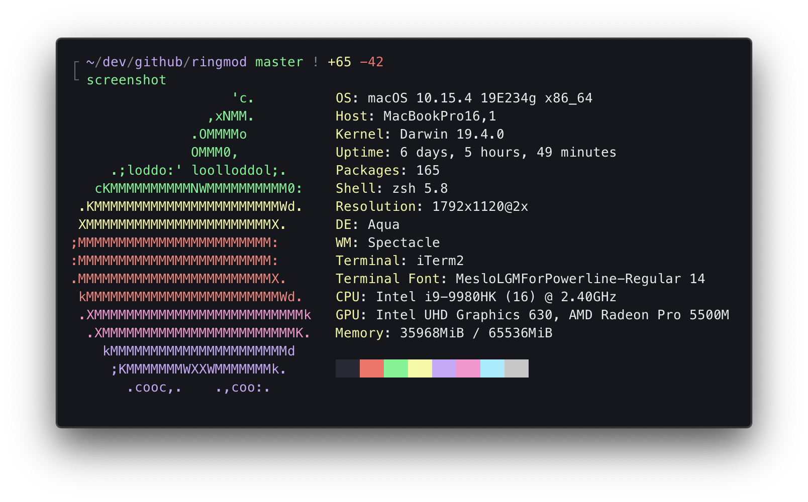

# dotfiles



## What is this?

This is a framework to manage your dotfiles. It is configured the way I like it.
You should extend / edit this however you like.

## Features

- `dot`: a bunch of built-in dotfiles [`zsh/.zshrc.d`](https://github.com/surjikal/dotfiles/tree/master/zsh/.zshrc.d)
- `dot theme`: minimal [powerlevel10k](https://github.com/romkatv/powerlevel10k_) theme
- `dot plugins`: [ohmyzsh](https://ohmyz.sh) & [antibody](https://getantibody.github.io) plugins
- `dot stow`: [stow](https://www.gnu.org/software/stow) support. See more info below.

## Installation

Install [brew](https://brew.sh/) first. Then run:

```
git clone https://github.com/surjikal/dotfiles.git ~/.dotfiles && cd $_
brew bundle
stow zsh
exec zsh -l
```

## Managing dotfiles

| command      | description                                      |
| ------------ | ------------------------------------------------ |
| `dot`        | edit dotfiles in vscode                          |
| `dot <file>` | edit a specific dotfile, supports tab completion |
| `reload`     | reload the shell                                 |
| `ohshit`     | escape hatch if shell is broken                  |

## Sample built-in aliases / functions

| command          | description                                 |
| ---------------- | ------------------------------------------- |
| `ramdisk <size>` | mount RAM volume (defaults to 8GB)          |
| `serve <port>`   | serve current dir (defaults to random port) |
| `vpn_start`      | starts your vpn                             |
| `ssh_tunnel`     | `ssh_tunnel <src> <dest> <host>`            |
| `gg`             | `git gui`                                   |
| `gk`             | `gitk --all`                                |
| `gf`             | `git fetch --all`                           |

## stow

[Stow](https://www.gnu.org/software/stow) will symlink the contents of a directory into your home directory.

For example, there's a `nano` directory in this repo that contains a `.nanorc`.
If you run `stow nano`, it will symlink `~/.dotfiles/nano/.nanorc` to `~/.nanorc`.

Run `dot stow` and edit the `STOWED` array to specify which dirs you want to stow on startup.

## Links

- https://github.com/ibraheemdev/modern-unix
- https://thorsten-hans.com/5-types-of-zsh-aliases#suffix-aliases

## Shoutouts to...

- [Mathias Bynens](https://mathiasbynens.be/)
- [Brandon LeBlanc](https://github.com/demosdemon)
- [draculatheme.com/gitk](https://draculatheme.com/gitk)
- [Amir Salihefendic](https://github.com/amix/vimrc)
